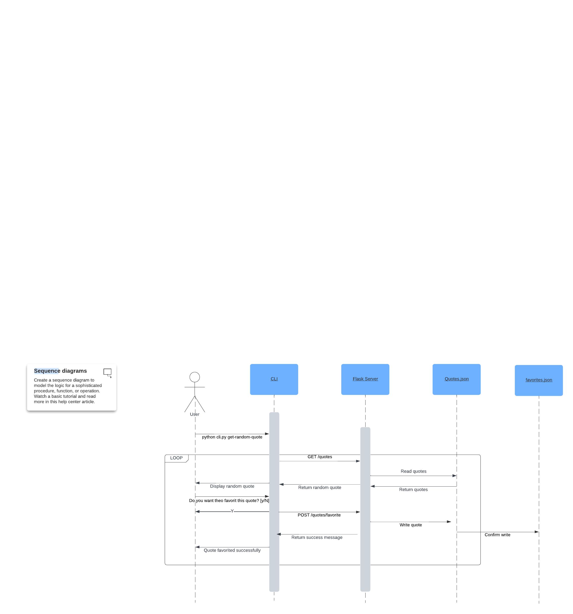

# Motivational Quote Microservice

## Overview
This microservice provides personalized motivational quotes to users, allowing them to receive random quotes, quotes based on categories, and favorite quotes.

## Endpoints

- `GET /quotes`: Get a random quote
- `GET /quotes?category=Inspiration`: Get a quote from a specific category (e.g., Inspiration, Focus, Funny Motivation, Success)
- `POST /quotes/favorite`: Favorite a quote
- `GET /quotes/favorites`: Get all favorite quotes

## Setup and Running the Microservice

### Prerequisites
- Python 3.9 or higher
- `pip` (Python package installer)
- `Flask`, `click`, and `requests` packages

### Installation
1. **Clone the Repository**:
    ```bash
    git clone https://github.com/alherrera-cs/Motivational_quote_microservice.git
    cd Motivational_quote_microservice
    ```

2. **Set up the Virtual Environment**:
    ```bash
    python3 -m venv venv
    source venv/bin/activate  # On Windows, use `venv\Scripts\activate`
    ```

3. **Install Dependencies**:
    ```bash
    pip install -r requirements.txt
    ```

### Running the Microservice
1. **Start the Flask Server**:
    ```bash
    export FLASK_APP=app.py
    flask run
    ```

    The server will be running at `http://127.0.0.1:5000`.

## Using the CLI

### Commands

1. **Get a Random Quote**:
    ```bash
    python cli.py get-random-quote
    ```

2. **Get a Quote by Category**:
    ```bash
    python cli.py get-category-quote
    ```

    When prompted, enter a category from the options (e.g., "Inspiration", "Focus", "Funny Motivation", "Success").

3. **Retrieve All Favorite Quotes**:
    ```bash
    python cli.py get-favorites
    ```

### Communication Contract

- **Request a random quote**:
    ```python
    import requests

    def get_quote(category=None):
        url = f"http://localhost:5000/quotes"
        if category:
            url += f"?category={category}"
        response = requests.get(url)
        return response.json()
    ```

- **Favorite a quote**:
    ```python
    def favorite_quote(quote):
        url = "http://localhost:5000/quotes/favorite"
        response = requests.post(url, json={"quote": quote})
        return response.json()
    ```

- **Retrieve favorite quotes**:
    ```python
    def get_favorites():
        response = requests.get("http://localhost:5000/quotes/favorites")
        return response.json()
    ```

### Example Usage

1. **Start the Microservice**:
    ```bash
    export FLASK_APP=app.py
    flask run
    ```

2. **Use the CLI**:
    ```bash
    python cli.py get-random-quote
    python cli.py get-category-quote
    python cli.py get-favorites
    ```

## UML Sequence Diagram

Here is the sequence of interactions in the microservice:



## Mitigation Plan

- **Teammate for Microservice A**: [Teammate's Name]
- **Current Status**: The microservice is complete and fully functional.
- **Access**: The microservice can be accessed via the repository on GitHub. Your teammate should clone the repository and run the microservice locally as documented.
- **Assistance**: If there are any issues accessing or calling the microservice, I will be available to help. Please contact me at [Your Email].
- **Notification**: If your teammate cannot access/call the microservice, they should notify you as soon as possible.

## Conclusion

The Motivational Quote Microservice is designed to provide users with random and category-specific motivational quotes and allows users to favorite quotes for future reference. The setup, usage, and endpoints are clearly documented to ensure ease of integration and functionality testing.

Thank you for using the Motivational Quote Microservice!
